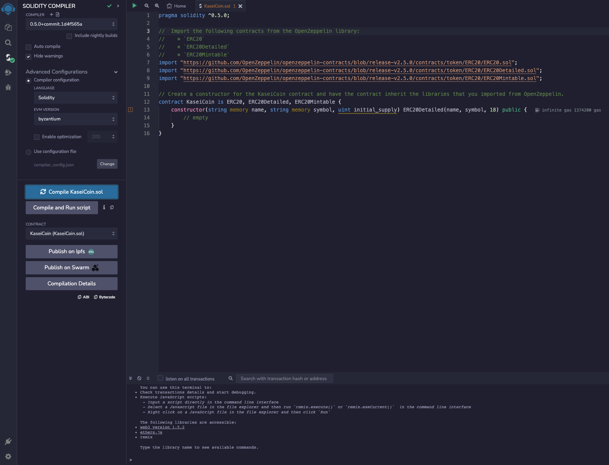
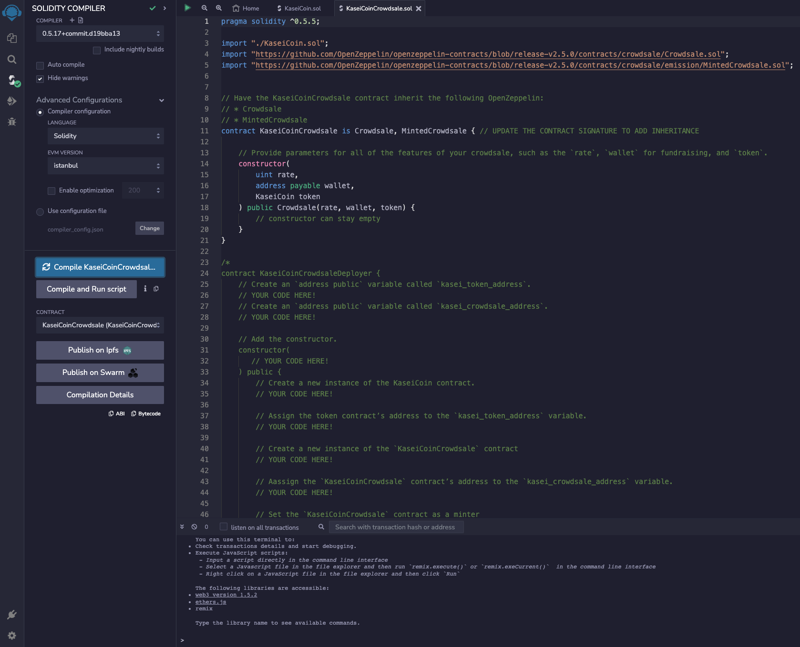
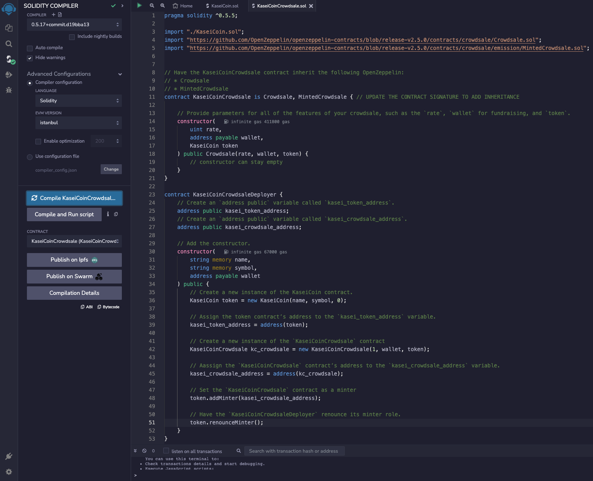

# Module21: Kasei Coin - Martian Token Crowdsale

## Evaluation Evidence
KaseiCoin contract compile:    

KaseiCoinCrowdsale contract compile:    

KaseiCoinCrowdsaleDeployer contract compile:    

All contracts deployed and working:    
Deploy the KaseiCoinCrowdsaleDeployer contract:    

The deployer creates contracts for the crowdsale and token, so they only need to be loaded from their addresses:    
Crowdsale:    

Buy Tokens:    

Check Balances:    
