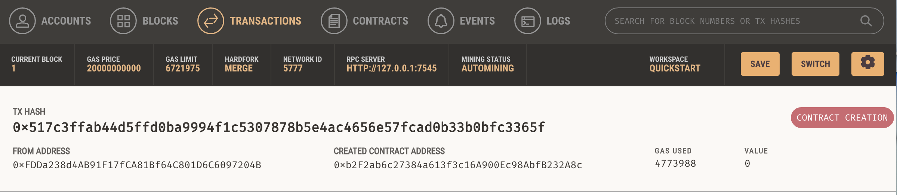

# Module21: Kasei Coin - Martian Token Crowdsale

## Buying tokens

1. Once all contracts are deployed, select an address from the dropdown other than the original Wallet address. Copy this address.
2. Enter a number of wei to purchase tokens with.
3. Click the `BuyTokens` button in the Crowdsale contract, after pasting in the copied address.
4. Make sure you have met the goal of the contract by clicking the `goalReached` button.
5. Make sure the contract is closed based on the time allotted by clicking `isOpen`.
6. Click `Finalize`.

## Evaluation Evidence
KaseiCoin contract compile:    

KaseiCoinCrowdsale contract compile:    

KaseiCoinCrowdsaleDeployer contract compile:    

### All contracts deployed and working:    
VIDEO: Deploy the KaseiCoinCrowdsaleDeployer contract:    

#### The deployer creates contracts for the crowdsale and token, so they only need to be loaded from their addresses:    
VIDEO: Crowdsale:    

VIDEO: Buy Tokens:    

VIDEO: Check Balances:    

## Optional
Contract Creation:

Contract Creation Review in Ganache:
